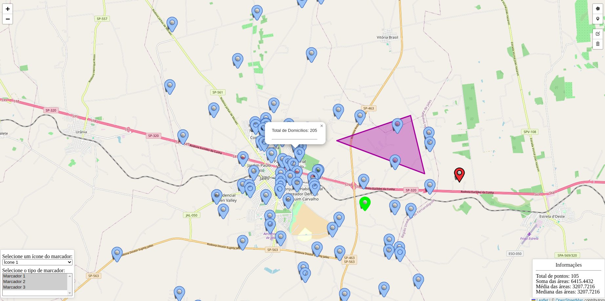
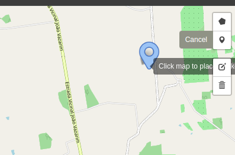
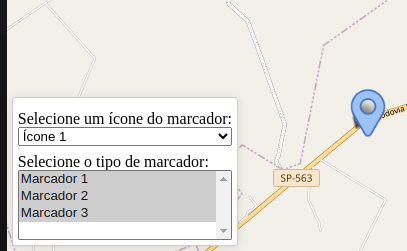
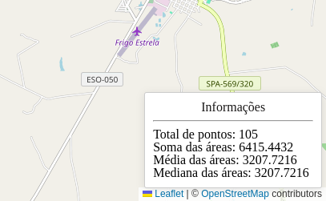
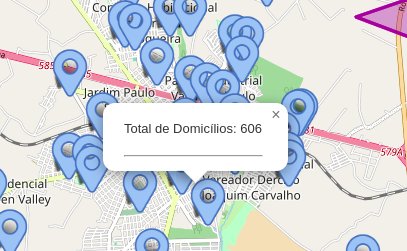
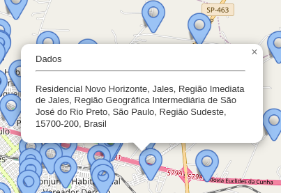

# Configuração do projeto

Certifique-se de ter o Node 16+ instalado e instale as dependências nas pastas `frontend`e `backend`

```bash
npm install --force
```

>Crie o arquivo `features.db` na pasta `backend/src/app/database`
>Crie uma cópia do arquivo `.env.example`, renomeie para `.env` na pasta backend e preencha com os seguintes valores:

```markdown
NODE_ENV=development
TZ='America/Sao_Paulo'
OSM_API_URL=https://nominatim.openstreetmap.org
```

Já para a pasta `frontend`, faça o mesmo e preencha o arquivo `.env` com os seguites valores:

```markdown
VITE_APP_API_URL=http://localhost:8080
```

## Executando a aplicação

Instalado as dependências de cada projeto, execute os seguintes comandos nas respectivas pastas:

- backend

  ```bash
    npm run start:dev
  ```

- frontend
  
  ```bash
    npm run dev
  ```

## Interagindo com a aplicação

Esta é a tela inicial

Alguns pontos do arquivo `base_jales_separado_virgula.csv` da pasta `files` são exibidos no mapa



### Inserindo pontos e polígonos no mapa

Para inserir pontos e polígonos, utilize os controles no canto direito superior da aplicação



Para exibir apenas alguns tipos de marcadores no mapa, selecione o tipo no seletor no canto esquerdo inferior da aplicação. Aqui também é possível escolher o ícone do marcador que deseja inserir no mapa, no seletor logo acima.



No canto direito inferior da aplicação é possível ver algumas informações no mapa, como o número de pontos, a soma, a média a mediana das áreas dos polígonos



### Informações

Ao clicar sobre os marcadores, são exibidas as informações correspondentes ao campo `censo_2022_domicilio_particular_poi_counts` do arquivo csv na pasta `files`:



Ao criar marcadores no mapa, a aplicação consulta a API do OpenStreetMaps e, caso haja alguma informação sobre aquele ponto marcado, as informações também são exibidas:


